<div align="center">

# Gabriel

### Software Developer | Backend • Data • Infrastructure


<br>


</div>

---

## Sobre mim

Desenvolvedor focado principalmente em **backend, bancos de dados, automação e infraestrutura**.

Tenho experiência prática construindo APIs, sistemas full-stack, pipelines de dados, integrações, migrações e ambientes containerizados.

Meu foco é entender o sistema de ponta a ponta: **código, banco, infraestrutura e observabilidade**.

---

## Stack

<table>
<tr>
<td width="50%" valign="top">

### Backend & Data

- Python / FastAPI
- Java / Spring Boot
- SQLAlchemy
- PostgreSQL
- MongoDB
- Apache Airflow
- Trino / Presto

</td>
<td width="50%" valign="top">

### Frontend & Infrastructure

- Vue / Nuxt / Pinia
- Docker / Compose
- Linux / VPS
- HAProxy
- Prometheus / Grafana
- Ansible
- Selenium

</td>
</tr>
</table>

---

## O que eu construo


**APIs e sistemas backend**  
Serviços REST, regras de negócio, integrações e aplicações orientadas a dados.

**Sistemas educacionais**  
Aplicações para alunos, matrículas, avaliações, frequência, calendários e processos administrativos.

**Dados e performance**  
Consultas SQL complexas, migrações, processamento em lote, otimização e tratamento de grandes volumes.

**Automação e infraestrutura**  
Airflow, Docker, monitoramento, reverse proxy, scripts de automação e administração de ambientes Linux.

---

## Projetos em destaque

### Analisador de Frequência

Aplicação full-stack para analisar e explicar diferentes metodologias de cálculo de frequência escolar.

```text
Nuxt / Vue
    ↓
FastAPI
    ↓
Regras de negócio
    ↓
PostgreSQL
```

O diferencial é apresentar não apenas o resultado, mas também as **etapas utilizadas para chegar ao cálculo**, facilitando validação e auditoria.

### Integrações & Monitoramento

Sistemas envolvendo dispositivos de controle de acesso, processamento de eventos, Spring Boot/WebFlux, MongoDB e observabilidade com Prometheus e Grafana.

### ETL & Migrações

Pipelines e scripts para extração, transformação, validação, migração e sincronização de dados.

---

## GitHub

<p align="center">
  

  
</p>

<p align="center">
  
</p>

---

<div align="center">

### `build · measure · understand · improve`

</div>
